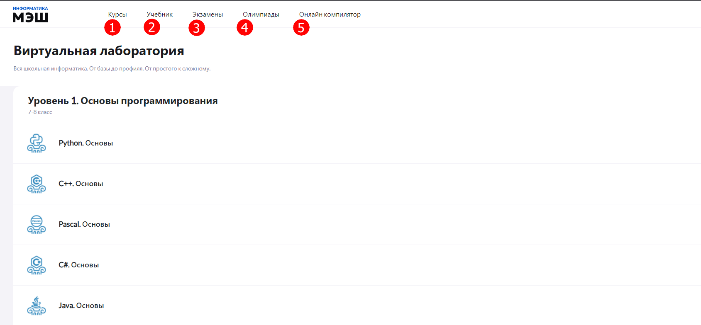

# Как найти материал по интересующей теме?

В личном кабинете ученика располагается главное меню, состоящее из пунктов: 

1. Курсы
2. Учебник
3. Экзамены
4. Олимпиады

В разделе «Курсы» - расположены модули с заданиями, по интересующей теме. «Учебник» - познакомит с теоретическим материалом. Раздел «Экзамены» поможет подготовится к ОГЭ, ЕГЭ и другим экзаменам. Группы тестовых заданий для подготовки к олимпиадам располагаются в разделе «Олимпиады».

