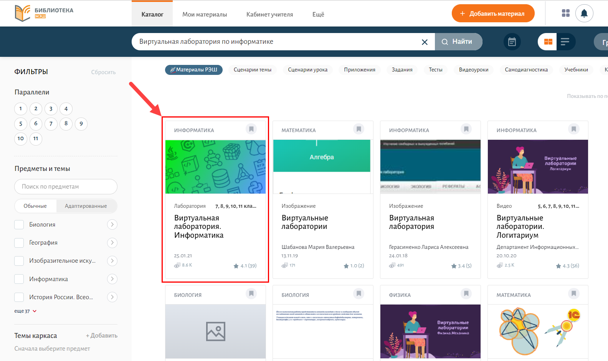
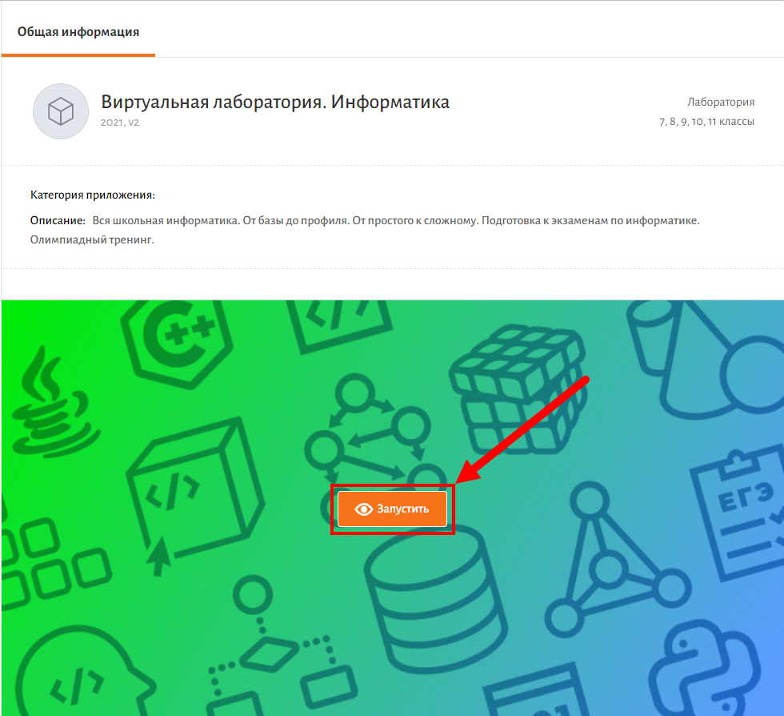
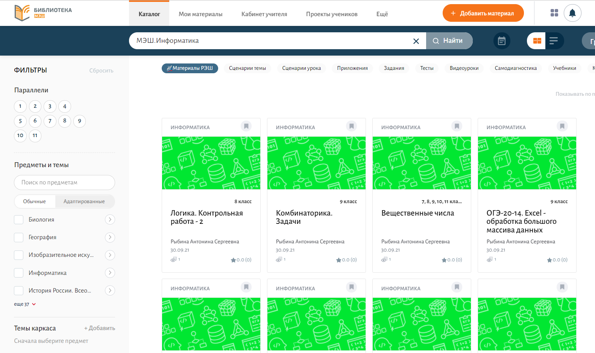

# Как найти материал по интересующей теме?

Для того, чтобы перейти к материалам по интересующей теме, необходимо:

1. Авторизоваться в библиотеке МЭШ.
2. В поисковую строку ввести "Виртуальная лаборатория по информатике".
3. Из предложенных результатов поиска выбрать "Виртуальная лаборатория. Информатика" (имеет заставку зелено-синего цвета, как на картинке ниже).
  
4. Нажать на кнопку "Запустить" в общей информации о виртуальной лаборатории. Откроется главная страница приложения "Виртуальная лаборатория".

В верхней части страницы располагается главное меню, состоящее из пунктов: 

1. Курсы
2. Учебник
3. Экзамены
4. Олимпиады
5. Онлайн компилятор

В разделе «Курсы» расположены модули с заданиями, по интересующей теме.

Раздел «Учебник» познакомит с теоретическим материалом.

Раздел «Экзамены» поможет подготовится к ОГЭ, ЕГЭ и другим экзаменам.

Группы тестовых заданий для подготовки к олимпиадам располагаются в разделе "Олимпиады".

Раздел "Онлайн компилятор" реализован для свободного программирования. 

Также в Библиотеке МЭШ есть опубликованные материалы по информатике. Для этого после авторизации в библиотеке МЭШ необходимо в строку поиска ввести "МЭШ.Информатика". Из предложенных вариантов выбрать интересующую Вас тему (материал от МЭШ.Информатика имеет заставку зеленого или синего цвета, как на картинке ниже).
