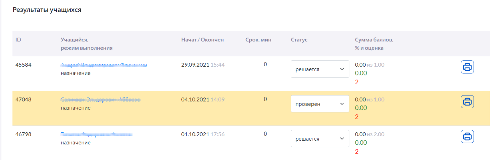
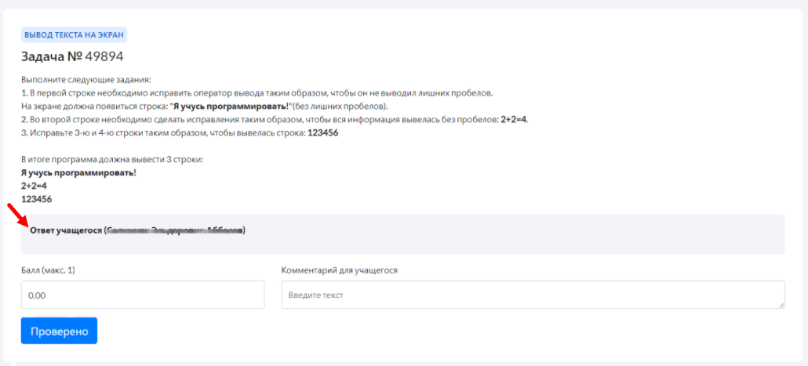

# Как учитель проверит выполнение задания?

В "Виртуальной лаборатории" учителю доступны просмотр и оценивание всех тестов и заданий, которые решили ученики. 

После того, как ученик выполнит задание, результаты выполнения будут отображены в личном кабинете учителя.

