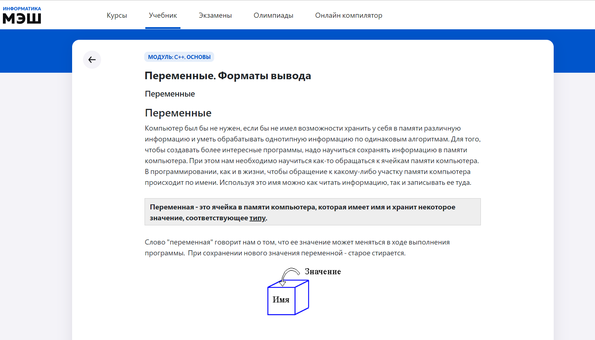
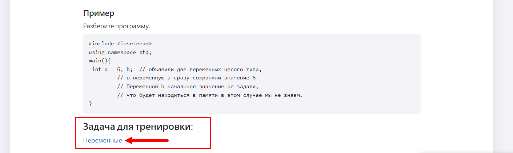
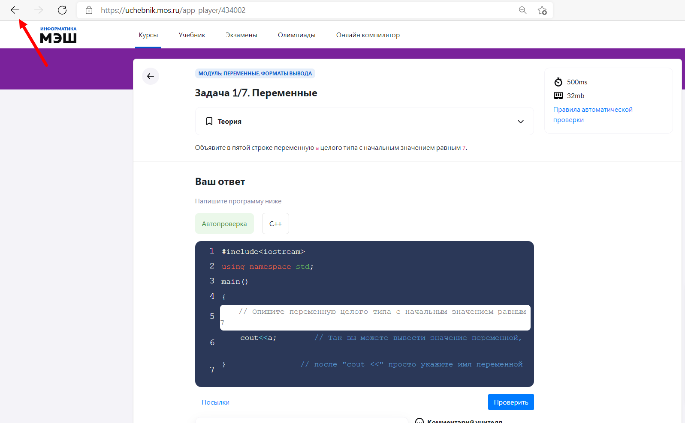

# Как пользоваться учебниками? 

Раздел «Учебник» создан для изучения теории по интересующей теме в области информатики и программирования. Для того, чтобы ознакомится с теоретическим материалом необходимо:

1. Выбрать пункт главного меню «Учебник» в приложении «Виртуальная лаборатория».
2. Выбрать вкладку с интересующей темой.
3. Нажать кнопку «Открыть».
  
4. Выбрать нужный модуль 
  
5. В результате выполненных действий отобразится теоретический материал выбранного модуля. 
  
К каждому теоретическому материалу приложена ссылка на задачу для тренировки. 
  
При нажатии на ссылку осуществляется переход в соответствующих модуль курса (из раздела главного меню "Курсы"). Чтобы вернуться от задачи к учебнику необходимо нажать на кнопку "Назад" в браузере. 
