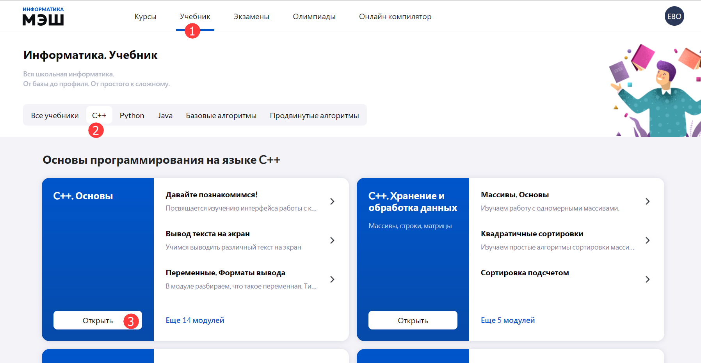
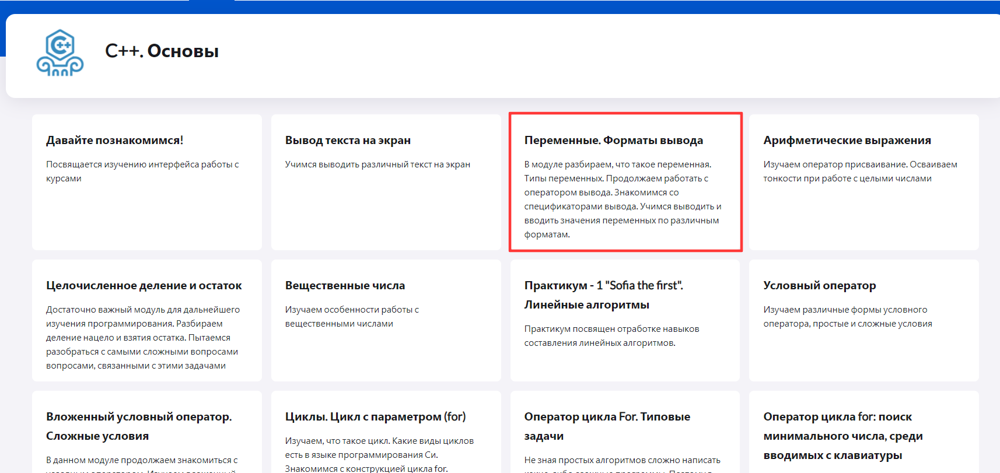

# Как пользоваться учебниками? 

Раздел «Учебник» создан для изучения теории по интересующей теме в области информатики и программирования. Для того, чтобы ознакомится с теоретическим материалом необходимо:

1. Выбрать пункт главного меню «Учебник» в приложении «Виртуальная лаборатория».
2. Выбрать вкладку с интересующей темой.
3. Нажать кнопку «Открыть».

4. Выбрать нужный модуль 

5. В результате выполненных действий отобразится теоретический материал выбранного модуля. 
