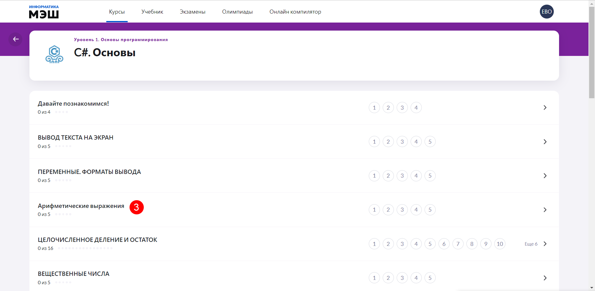

# Как пройти курс по информатике и программированию?

Для того, чтобы пройти курс необходимо выполнить следующие действия:

1. В главном меню приложения "Виртуальная лаборатория" выбрать пункт "Курсы".
2. Используя вертикальный скролл выбрать нужный курс.
  
3. В меню курса выбрать нужный модуль по интересующей теме.
  
4. Внутри модуля располагаются задачи. Для успешного решения, следует ознакомиться с условиями и теоретическим материалом, если он прилагается к задаче. Правила выполнения задания изменяются в зависимости от типа задачи (подробнее о типах задач см. раздел ["Какие типы задач есть в "Виртуальной лаборатории?"](../01-for-students/1.8.md)).
5. Решить задачу, согласно заданию.
6. Нажать кнопку «Проверить».
7. В результате выполненных действий отобразится информация с результатом. 
8. Для решения следующей задачи, включенной в модуль курса, нажать кнопку "Следующая задача". 

