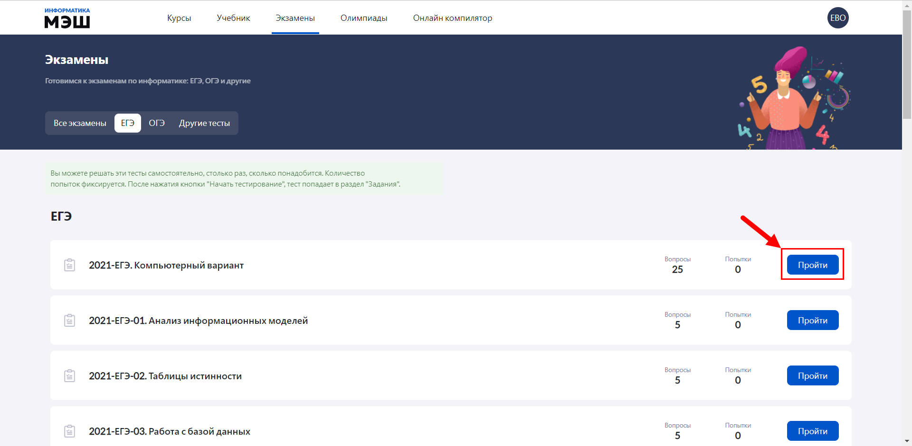
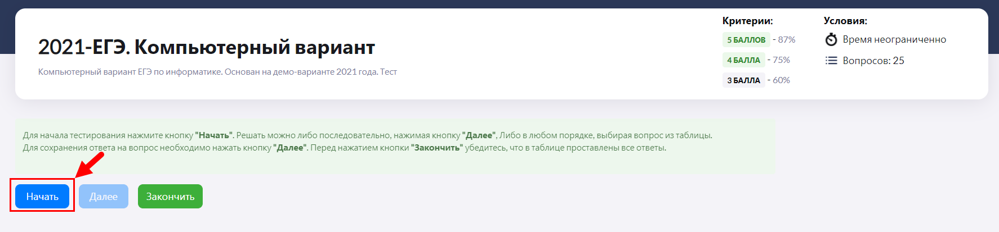
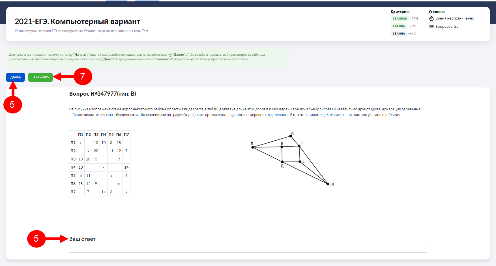
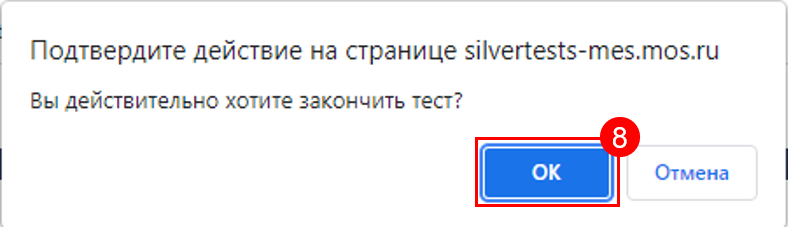
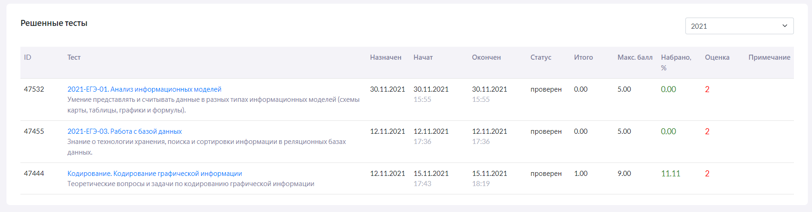

# Как тренироваться перед экзаменом?

Для того, чтобы самостоятельно подготовиться к экзамену по информатике ученику необходимо выполнить следующие действия:

1. В главном меню приложения "Виртуальная лаборатория" выбрать пункт «Экзамены».
2. На панели фильтров выбрать нужный вид экзамена
   
Всего доступны 4 фильтра экзаменов: 
• все экзамены – доступен весь список тестов, без привязки к определенному виду экзамена;  
• ЕГЭ – доступны только варианты тестов экзаменов ЕГЭ за предыдущие годы;  
• ОГЭ – доступны только варианты тестов экзаменов ОГЭ за предыдущие годы;  
• другие тесты – доступны варианты тестов для подготовки к контрольным работам и экзаменам, не входящих в список ЕГЭ/ОГЭ.

3. Нажать кнопку «Пройти».
  
4. Ознакомиться с критериями и условиями теста и нажать кнопку «Начать».
  
В экзамен могут быть включены разные типы задач (подробнее о типах задач см. раздел ["Какие типы задач есть в "Виртуальной лаборатории?"](../01-for-students/1.8.md)). При каждой попытке прохождения экзамена генерируются разные варианты.
5. В текущем вопросе указать ответ в поле «Ваш ответ» и нажать кнопку «Далее».
6. Повторить алгоритм пункта 5, для остальных вопросов, включенных в тест.
7. Нажать кнопку «Закончить».
  
8. Следом нажать "ОК".
  
9. В результате выполненных действий отобразится таблица "Решенные тесты", которая содержит информацию о всех решенных тестовых вариантах, включая автоматически выставленные оценки. Последний пройденный тестовый вариант отображается в первой строке таблицы.
  

