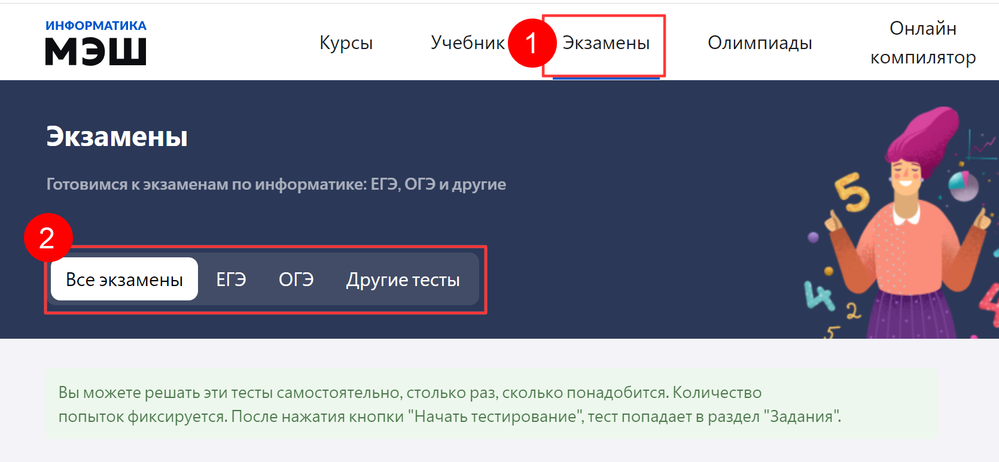

# Как тренироваться перед экзаменом?

Для того, чтобы самостоятельно подготовится к экзамену по информатике ученику необходимо выполнить следующие действия:

1. Выбрать пункт главного меню «Экзамены» в лчном кабинете приложения «Виртуальная лаборатория».
 
Фильтр по видам экзаменов
2. На панели фильтров выбрать нужный вид экзамена:
a) все экзамены – доступен весь вписок тестов, без привязки к определенному виду экзамена; b) ЕГЭ – доступны только варианты тестов экзаменов ЕГЭ за предыдущие годы; c) ОГЭ – доступны только варианты тестов экзаменов ОГЭ за предыдущие годы; d) другие тесты – доступны варианты тестов для подготовки к контрольным работам и экзаменам, не входящих в список ЕГЭ/ОГЭ.

a) все экзамены.

b) ЕГЭ.

c) ОГЭ.

d) другие тесты.

3. Нажать кнопку «Пройти».
4. Ознакомиться с критериями и условиями теста и нажать кнопку «Начать».
5. В текущем вопросе указать ответ поле «Ваш ответ» и нажать кнопку «Далее».
6. Повторить алгоритм пункта 5, для остальных вопросов, включенных в тест.
7. Нажать кнопку «Закончить», следом нажать "ОК"
8. В результате выполненных действий в таблице отобразится информация о решении тестового варианта, включая автоматически выставленную оценку.

