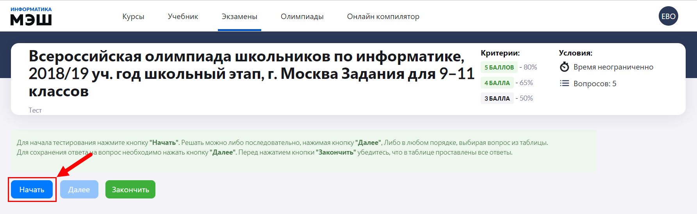
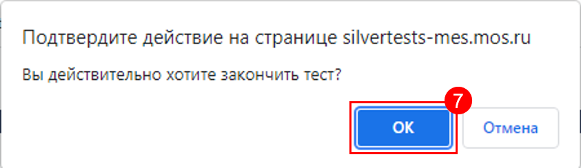
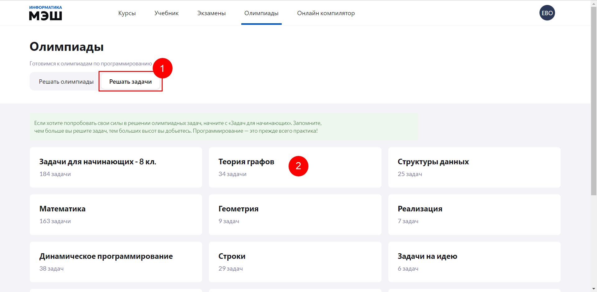
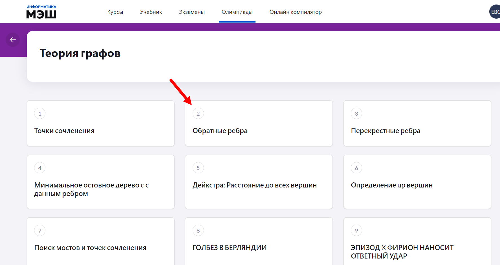
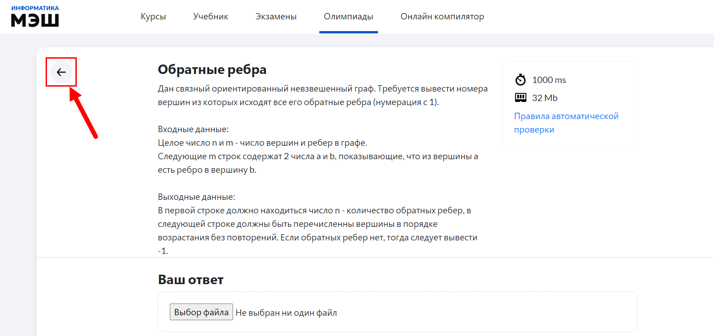

# Как готовиться к олимпиаде?

Для того, чтобы подготовится к олимпиаде и самостоятельно пройти олимпиадные тесты, ученику необходимо в главном меню приложения "Виртуальная лаборатория" выбрать пункт "Олимпиады".

Для ученика доступны два режима подготовки к олипмиаде:

1. Решать олимпиады - это реальные тесты с прошедших мероприятий.
2. Решать задачи - это олимпиадные задачи, разбитые по темам.

### Решать олимпиады

Для того, чтобы прорешать тесты с прошедших олимпиад, ученику необходимо выполнить следующие действия:

1. Выбрать вкладку «Решать олимпиады».
2. Выбрать нужную олимпиаду.
  
3. Выбрать интересущее мероприятие. 
  
4. Ознакомиться с условиями тестирования и нажать кнопку "Начать".
  
5. Выполнить тест, согласно заданию. Правила выполнения заданий изменяются в зависимости от типа задачи (подробнее о типах задач см. раздел ["Какие типы задач есть в "Виртуальной лаборатории?"](../01-for-students/1.8.md)).
6. Нажать кнопку «Закончить».
7. Следом нажать "ОК".

### Решать задачи

Для того, чтобы прорешать олимпиадные задачи по определенной теме, ученику необходимо выполнить следующие действия:

1. Выбрать вкладку "Решать задачи".
2. Выбрать нужную тему.
  
3. Выбрать интересующую задачу.
  
4. Выполнить задание, согласно условию. Правила выполнения задания изменяются в зависимости от типа задачи (подробнее о типах задач см. раздел ["Какие типы задач есть в "Виртуальной лаборатории?"](../01-for-students/1.8.md)).
5. После выполнения задания нажать кнопку "Назад", чтобы вернуться к списку задач.

