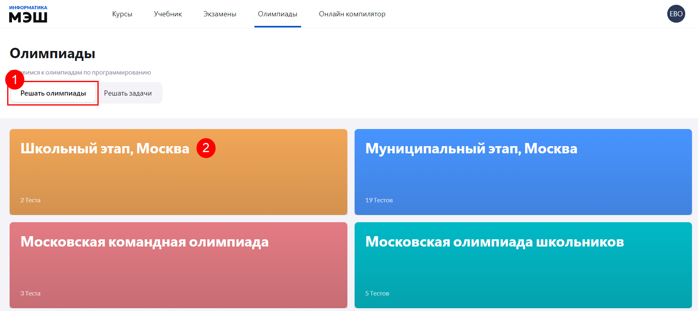

# Как готовиться к олимпиаде?

Для того чтобы, поготовится к олимпиаде и самостоятельно пройти олимпиадные тесты, ученику необходимо выполнить следующие действия:

1. Выбрать пункт главного меню «Олимпиады» в личном кабинете приложения «Виртуальная лаборатория».
2. Выбрать вкладку «Решать олимпиады».
3. Выбрать нужную олимпиаду.

4. Выбрать нужную тему.

5. Выполнить тест, согласно заданию.
6. Нажать кнопку «Проверить», отобразится информация с результатом.

