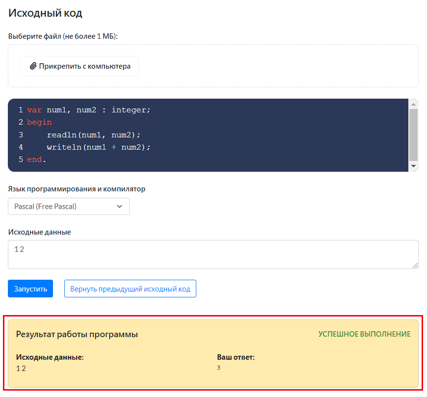
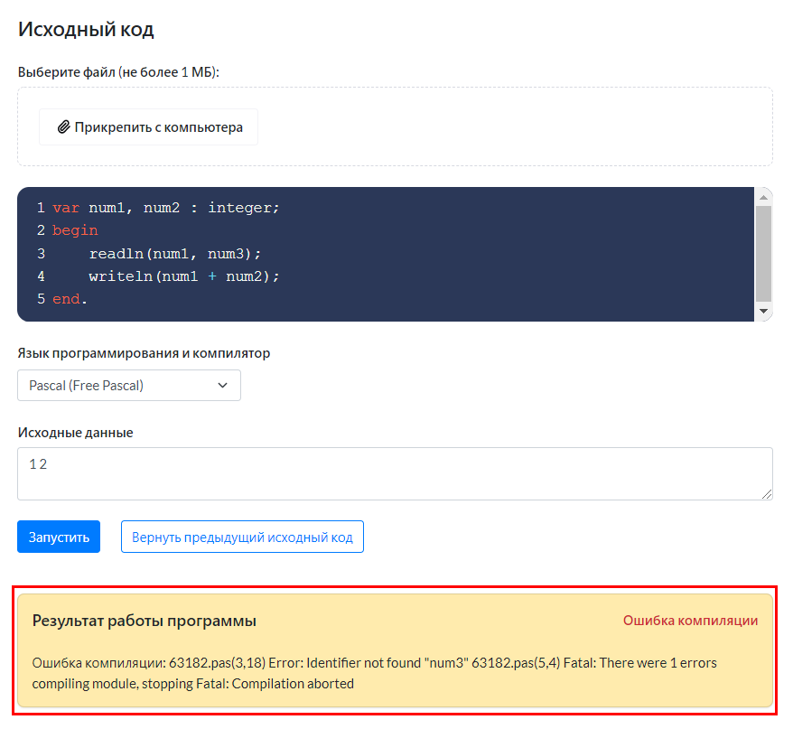
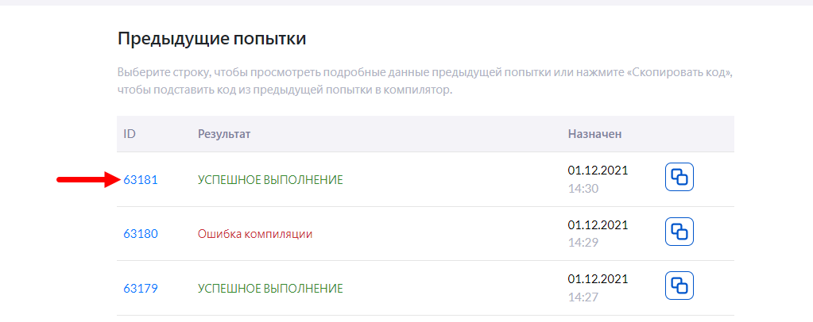
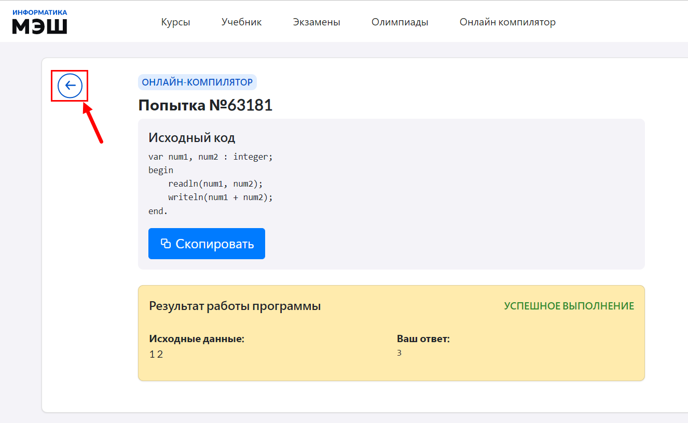
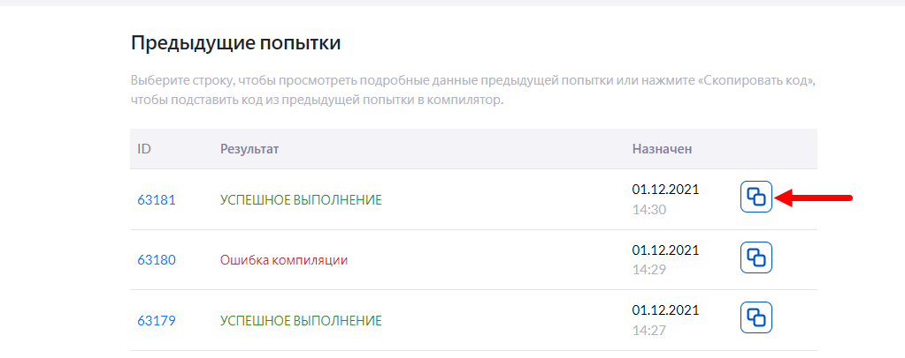

# Как практиковаться в написании программ?

Проверить код на работоспособность, узнать свои ошибки и результат выполнения программы можно воспользовавшись онлайн компилятором. С его помощью возможно изучение программирования без установки специализированной среды для разработки на компьютере.

 Для запуска написанной программы или написания новой программы необходимо:

 1. В главном меню приложения "Виртуальная лаборатория" выбрать пункт "Онлайн компилятор".
 2. В блоке «Исходный код» в списке «Язык программирования и компилятор» выбрать нужное значение.
 3. В окно редактора ручного ввода ввести программный код. 
   
 Код можно вводить не только вручную, но и загрузить из файла. Для этого следует нажать кнопку «Прикрепить с компьютера». Выбрать нужный файл и нажать кнопку "Открыть". Следует обратить внимание, что на выбранный файл действуют ограничения, связанные с типом и размером файла. 
   
 4. В поле «Исходные данные» ввести исходные данные для запуска написанной программы, если требуется.
 5. После введения произвольного кода, либо загрузки кода из файла, следует нажать кнопку «Запустить».
 6. В результате выполненных действий отобразится поле, где будет указан результат работы программы. Если программа выполена успешно, то будут отображены: текст "Успешное выполнение", исходные данные и ответ программы.
   
Если в программе есть ошибки, то в поле с результатом работы программы будут отображены: текст "Ошибка компиляции" и текст ошибки компиляции.
  

Также в онлайн компиляторе доступен просмотр предыдущих попыток компиляции программ. Доступны действия:

- просмотр подробных данных о предыдущей попытке. Для этого необходимо нажать на ID попытки;
  
После чего будут отображены: исходный код предыдущей попытки и блок с результатом работы программы. Для возвращения к онлайн компилятору необходимо нажать кнопку "Назад".
  
- копирование и подставление кода из предыдущей попытки в окно редактора ручного ввода. Для этого необходимо нажать на кнопку "Скопировать код".

