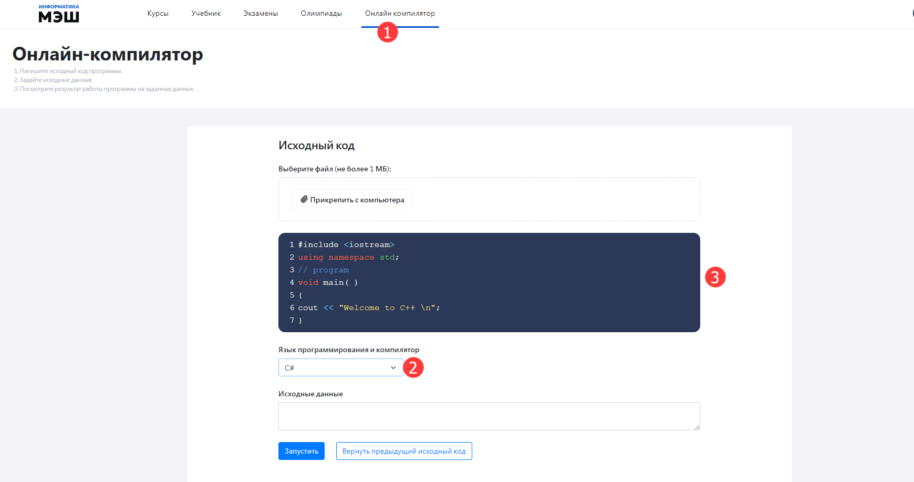

# Как практиковаться в написании программ?

 Проверить код на работоспособность, увидеть ошибки и результат выполнения программы, для этого нужно воспользоваться онлайн компилятором. С его помощью возможно изучение программирования без установки специализированной среды для разработки на компьютере.
 Для запуска написанной программы необходимо:

 1. Выбрать пункт главного меню «Онлайн компилятор» в личном кабинете приложения «Виртуальная лаборатория».
 2. В блоке «Исходный код» в списке «Язык программирования и компилятор» выбрать нужное значение.
 3. В окно редактора ручного ввода ввести программный код. 
 
 Код можно вводить не только вручную, но и загрузить из файла. Для этого следует нажать кнопку «Прикрепить с компьютера». Выбрать нужный файл и нажать кнопку "Открыть".  
 4. В поле «Исходные данные» ввести исходные данные для запуска написанной программы, если требуется.
 5. После введения произвольного кода , либо загрузки кода из файла, следует нажать кнопку «Запустить».
 6. В результате выполненных действий отобразиться поле с результатом успешной обработки программы.
 7. В случае возникновения ошибок отобразится сообщение с описанием ошибки.

