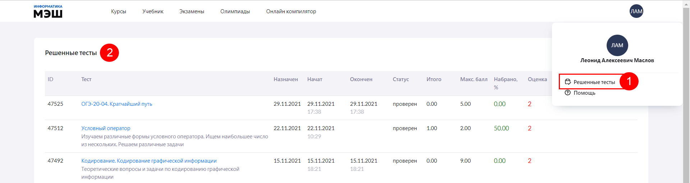
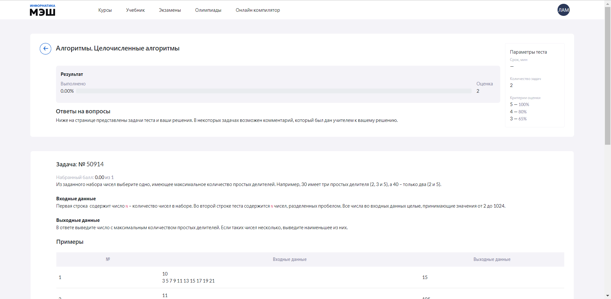
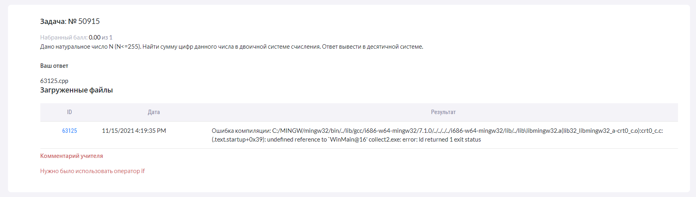

# Как посмотреть историю своих решений?

Для просмотра решенных ранее тестов, ученику необходимо выполнить следующие действия:

1. В окне авторизации выбрать «Решенные тесты».
2. Отобразится список, в котором присутствуют строки с информацией о пройденных тестах. В данном списке видны только завершенные задания. Модули курсов отобразятся здесь только в том случае, если учитель отметит, что они проверены.

Для детального просмотра решенного теста необходимо нажать на название теста. Отобразится страница с результатом теста, списком задач с ответами ученика и комментариями учителя (если учитель не оставил комментарий, поле "Комментарий" будет пустым).
  
