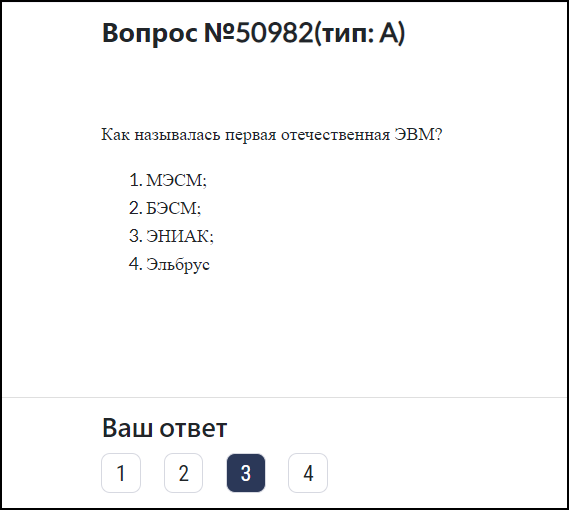
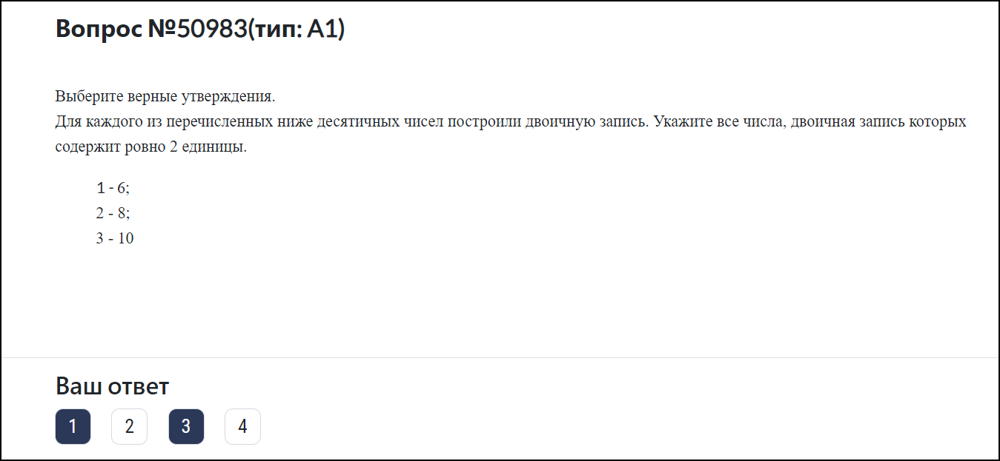
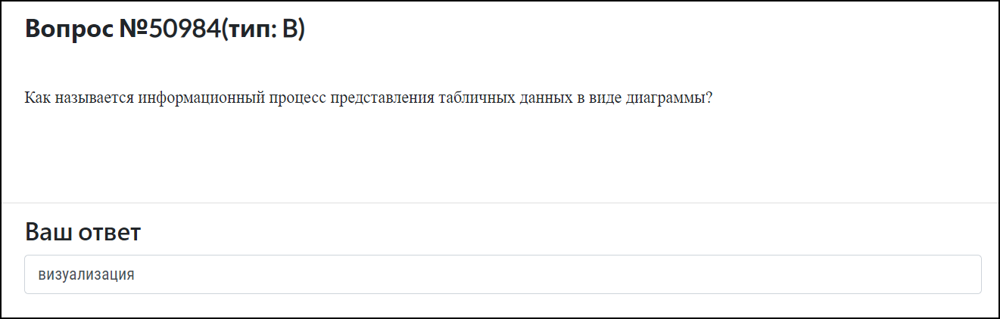
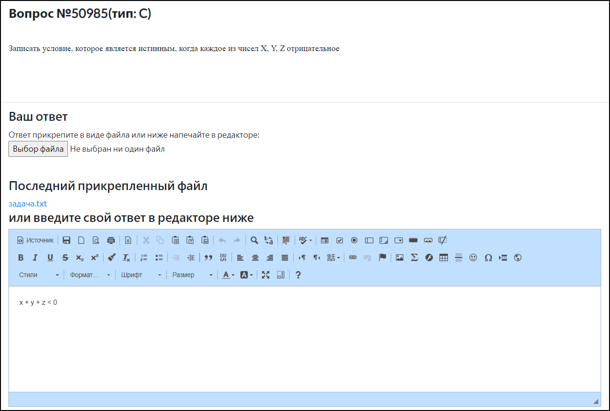
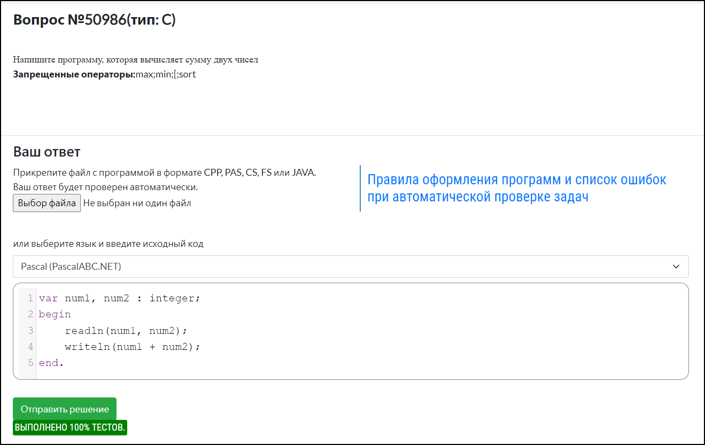
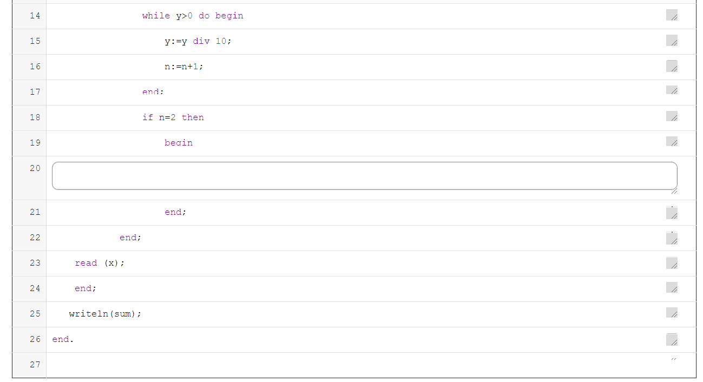

# Какие типы задач есть в "Виртуальной лаборатории"?

В "Вирутальной лаборатории" существуют несколько типов задач:

-	**Тип A** – задача с одним правильным ответом;
  
-	**Тип А1** – задача с несколькими правильными ответами;
  
-	**Тип В** – задача с кратким письменным ответом;
  
-	**Тип С-открытая** – задача со свободным письменным ответом. Можно прикрепить ответ в виде файла или напечатать его в редакторе;
  
-	**Тип С-автопроверка** – задача на программирование с автопроверкой. Код программы можно прикрепить в виде файла в формате CPP, PAS, CS, FS или JAVA, или выбрать язык программирования и ввести исходный код вручную;
  
-	**На вставку части кода** – задача со вставкой части кода программы.
  