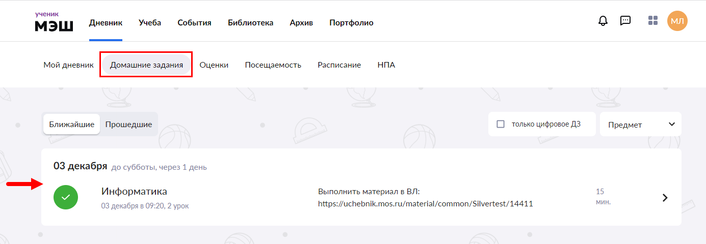
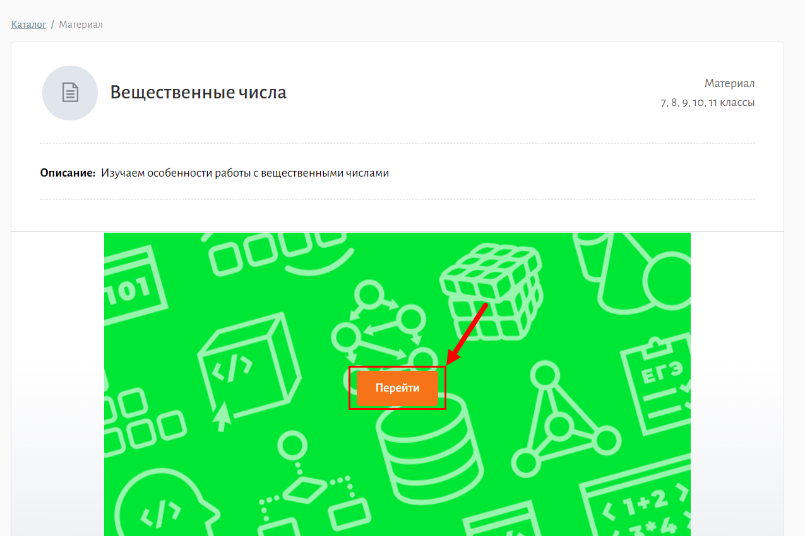
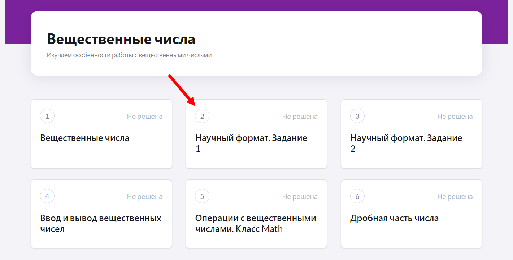
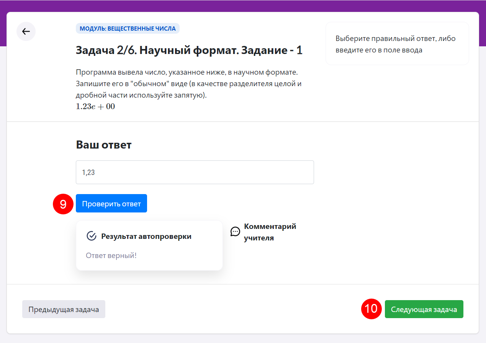
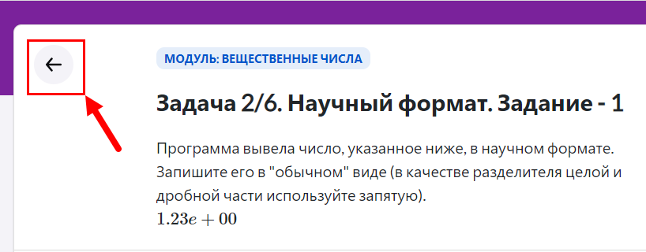
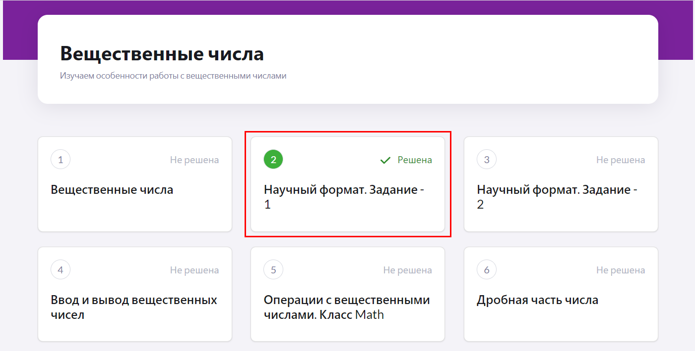

# Как выполнить ДЗ по информатике?

Для выполнения домашнего задания по информатике ученику необходимо:

1. Авторизоваться в "Библиотеке МЭШ".
2. Зайти в "Дневник МЭШ", перед этим авторизовавшись в нем.
3. Перейти во вкладку "Домашние задания", выбрать необходимое задание и нажать на него.
  
4. Скопировать ссылку на тест из текста задания.
5. Вставить скопированную ссылку в поисковую строку. Откроется тест, заданный на дом.
6. Нажать кнопку "Перейти".
  
7. Откроется список задач. Нажать на нужную задачу.
  
8. Решить задачу в соответствии с условием. Правила выполнения задания изменяются в зависимости от типа задачи (подробнее о типах задач см. раздел ["Какие типы задач есть в "Виртуальной лаборатории?"](../01-for-students/1.8.md)).
9. После ввода/выбора ответа на задание нажать кнопку "Проверить ответ".
10. Для перехода к следующей задаче необходимо нажать на кнопку "Следующая задача".

Для того, чтобы вернуться к списку задач, необходимо нажать кнопку "Назад".

Решенные задачи будут помечены галочкой и выделены зеленым цветом.

