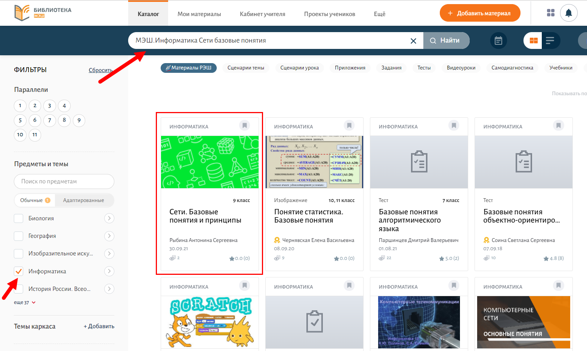
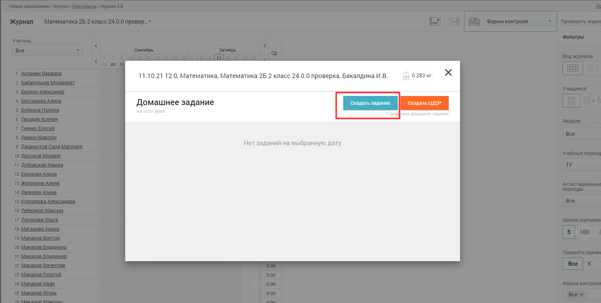
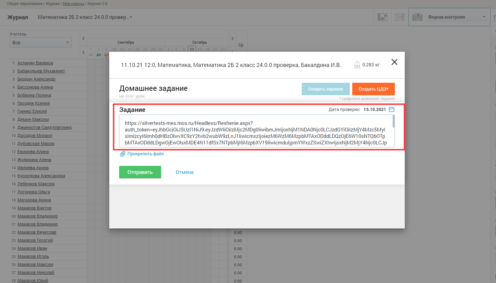

# Как задать материал "Виртуальной лаборатории" на дом? 

Для того, чтобы задать материал "Виртуальной лаборатории" на дом, необходимо:

1. Авторизоваться в библиотеке МЭШ.
2. В поисковой строке указать интересующую тему, в фильтре, в разделе "Предметы и темы" выбрать информатику.
3. Из предложенных результатов поиска выбрать материал "Виртуальной лаборатории" (имеет заставку зеленого либо синего цвета, как на картинке ниже).

4. Скопировать адресную строку страницы, где расположен учебный материал.

5. Перейти в "Дневник и журнал МЭШ", предварительно зарегистрироваться в нем.
6. Открыть раздел журнал, указать нужный класс.
7. Назначить домашнее задание, выбрав интересующую дату.
8. В задании указать ссылку, скопированную ранее (пункт 4).
9. Нажать кнопку «Отправить».

