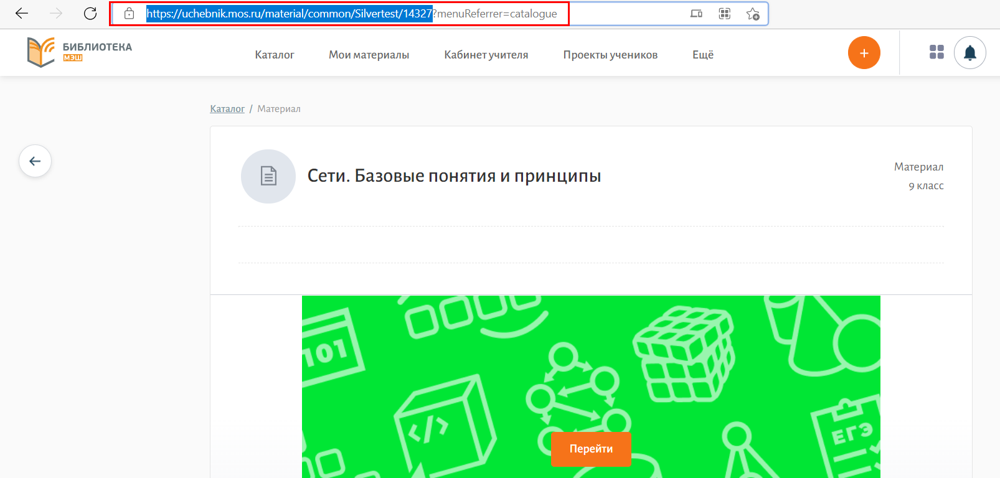

# Как задать материал "Виртуальной лаборатории" на дом? 

Для того, чтобы задать материал "Виртуальной лаборатории" на дом, необходимо:

1. В поисковой строке указать "МЭШ.Информатика" и интересующую тему, в фильтре, в разделе "Предметы и темы" выбрать информатику.
2. Из предложенных результатов поиска выбрать материал "Виртуальной лаборатории" (имеет заставку зеленого либо синего цвета, как на картинке ниже).
  
3. Скопировать адресную строку страницы, где расположен учебный материал, в виде: https://uchebnik.mos.ru/material/common/Silvertest/14971.
  
4. Перейти в "Дневник и журнал МЭШ", предварительно авторизоваться в нем.
5. Слева в меню выбрать раздел "Мое расписание". Откроется расписание уроков учителя.
6. Найти дату и урок, на которую нужно назначить домашнее задание. Навести курсор на нужный урок и нажать на кнопку "Страница урока".
  
7. Нажать кнопку "Создать домашнее задание".
  
8. Нажать кнопку "Открыть описание".
  
9. В поле "Описание задания" указать ссылку, скопированную ранее (пункт 3).
10. При необходимости, прикрепить дополнительные материалы с компьютера, нажав кнопку "Прикрепить файл с компьютера".
11. Выбрать дату проверки и время выполнения задания.
12. При необходимости, выбрать учащихся, кому выдать домашнее задание: всему классу или ученикам на выбор.
13. При необходимости, добавить еще одно задание, нажав кнопку "Добавить задание". После чего повторить пункты 9-12.
14. Нажать на кнопку "Выдать задание".
  
15. Нажать кнопку "Выдать домашнее задание".
  

