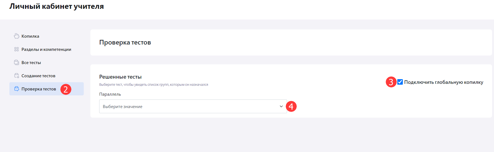
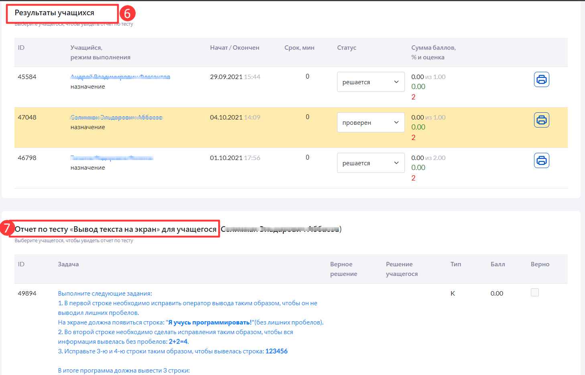
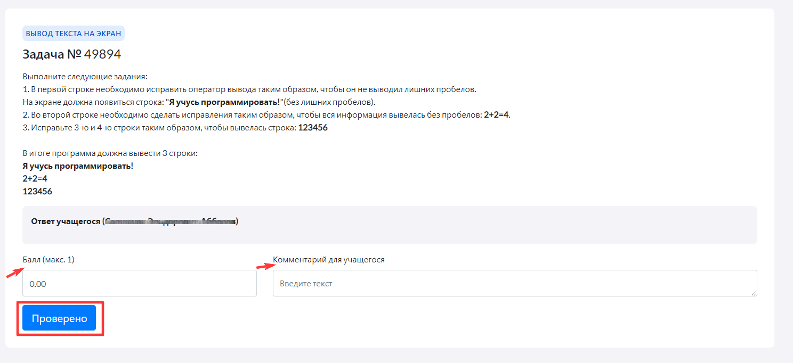
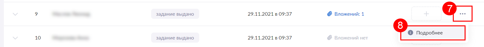

# Где посмотреть и проверить результаты учащихся?

Просмотр и проверка результатов учащихся доступны двумя способами:

1. В личном кабинете учителя в "Виртуальной лаборатории".
2. В "Дневнике и журнале МЭШ".

### В личном кабинете учителя в "Виртуальной лаборатории"

Для того, чтобы просмотреть и проверить результаты учащихся в личном кабинете в "Вирутальной лаборатории", учителю необходимо:

1. Пройти в личный кабинет учителя в "Виртуальной лаборатории".
2. В меню слева выбрать раздел "Проверка тестов".
3. Подключить "Глобальную копилку".
4. В строке "Параллель" выбрать нужное значение.
  
5. Из предложенного списка тестов, кликнуть на интересующий.
6. В конце списка отобразится блок "Результаты учащихся". Из списка следует выбрать ученика. 
7. Отобразится следующий блок "Отчет по тесту", в котором учитель может ознакомится с результатами решений учащегося. 
  
8. В отчете по тесту следует кликнуть на тело задачи, отобразится форма с описанием задачи. В которой можно оставить комментарий и указать баллы.
9. Нажать кнопку "Проверено".

### В "Дневнике и журнале МЭШ"

Для того, чтобы посмотреть и проверить результаты учащихся в "Дневнике и журнале МЭШ", учителю необходимо:

1. Авторизоваться в "Дневник и журнал МЭШ".
2. Слева в меню выбрать раздел "Домашние задания".
3. Найти необходимое домашнее задание из списка и отрыть его.
5. Нажать на вкладку "Результат выполнения".
7. Отображается список учеников. Выбрать нужного ученика из списка и нажать на кнопку с тремя точками в правой части строки.
8. В выпадающем списке нажать на кнопку "Подробнее".
  
Отображается подробная информация о выполнении домашнего задания выбранным учеником.

