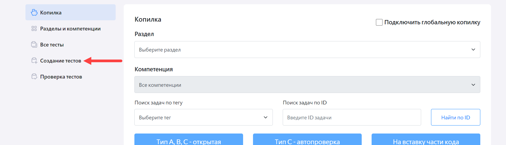
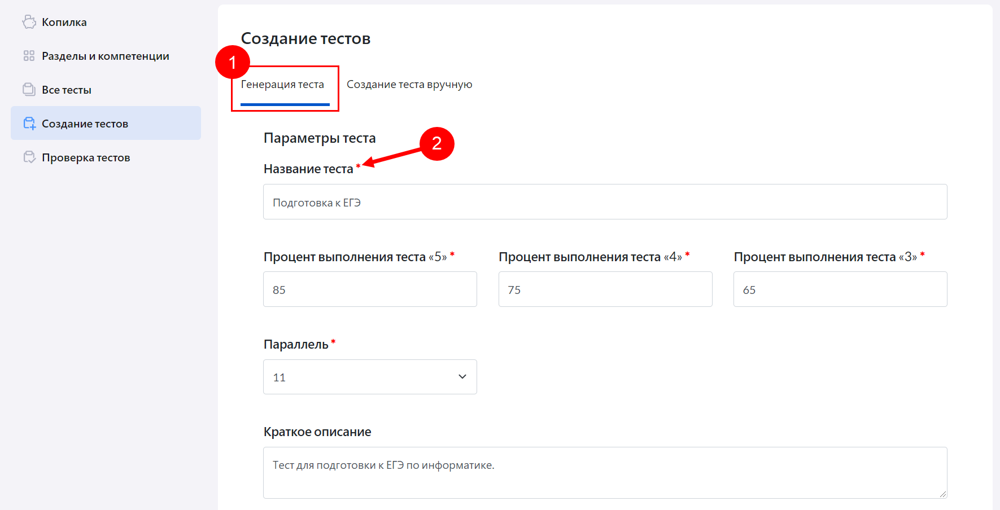
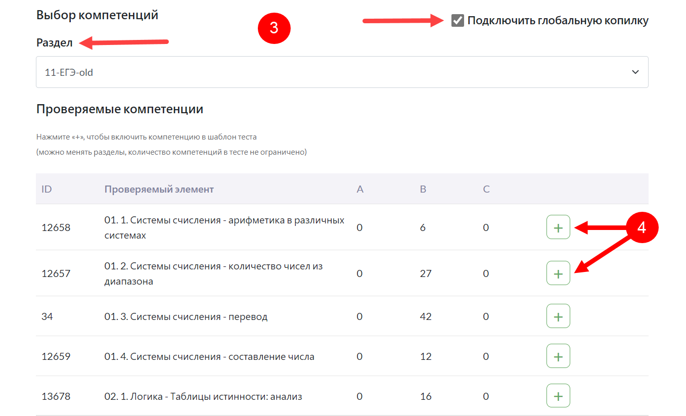
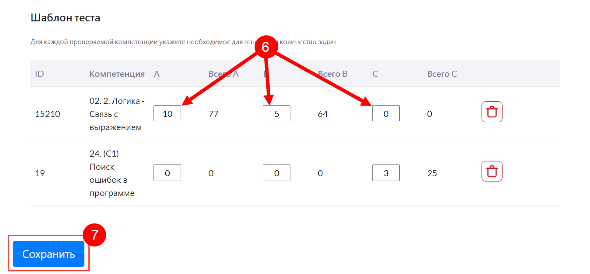
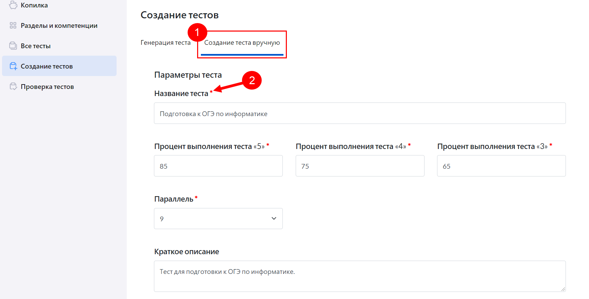
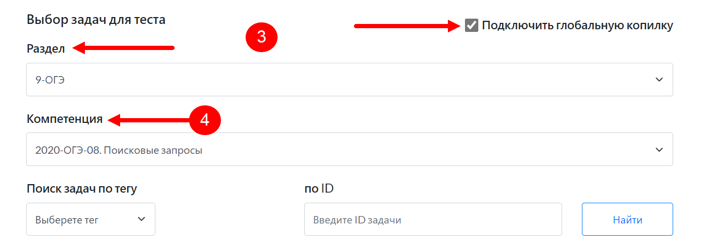
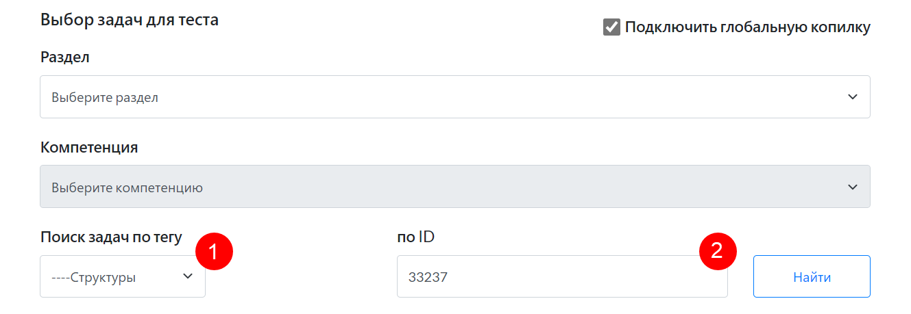
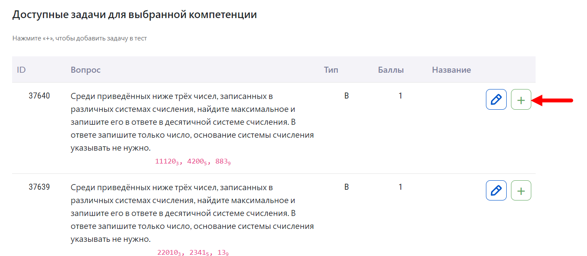
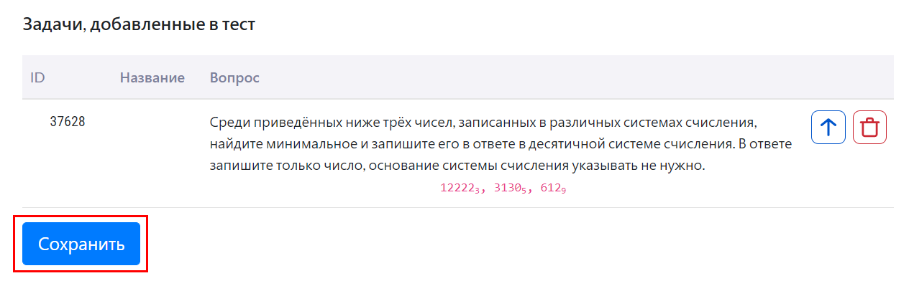

# Как создать свой тест?

Для того, чтобы создать свой тест, учителю необходимо:

1. Пройти в личный кабинет учителя в "Виртуальной лаборатории".
2. В меню слева выбрать раздел "Создание тестов".

Доступны два вида создания тестов: генерация теста и создание теста вручную.

Генерация теста - это автоматическая генерация теста с указанным количеством заданий по указанной теме из глобальной копилки или из ранее созданных учителем компетенций.

Создание тестов вручную - это выбор вручную каждого тестового задания.

### Генерация теста

Для генерации теста учителю необходимо:

1. Перейти на вкладку «Генерация теста».
2.	Заполнить обязательные поля, помеченные звездочками. При необходимости добавить краткое описание теста.

3.	Выбрать раздел. Если у учителя нет созданных им разделов, их можно создать (подробнее см. раздел ["Как расширить список компетенций?"](../01-for-students/2.5.md)) или подключить «Глобальную копилку».
4.	Нажать «+» напротив необходимых компетенций для добавления их в тест.

5.	Пролистнуть страницу в конец, до раздела «Шаблон теста».
6.	Указать необходимое для генерации количество задач для каждой проверяемой компетенции.
7.	Нажать кнопку «Сохранить».

### Создание теста вручную

Для создания теста вручную учителю необходимо:

1. Перейти на вкладку «Создание теста вручную».
2. Заполнить обязательные поля, помеченные звездочками. При необходимости добавить краткое описание теста.

3. Выбрать раздел, в котором будет осуществляться поиск задач. Если у учителя нет созданных им разделов, их можно создать (подробнее см. раздел ["Как расширить список компетенций?"](../01-for-students/2.5.md)) или подключить «Глобальную копилку».
4. Выбрать компетенцию, в которой будет осуществляться поиск задач.

Также поиск задач можно осуществлять по тегу (1) и по ID задачи (2).

5. Нажать «+» напротив необходимых задач для добавления их в тест.

6. Пролистнуть страницу в конец, до раздела «Задачи, добавленные в тест».
7. Нажать кнопку «Сохранить».

