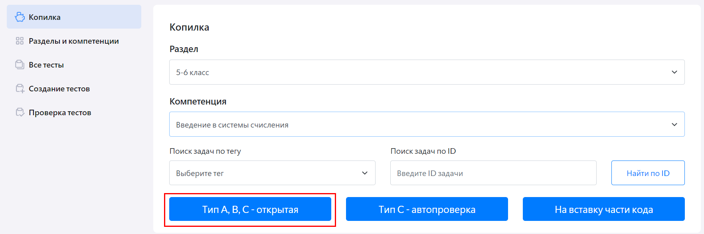

# Как добавить свою задачу?

Для того, чтобы создать свою задачу, учителю необходимо:

1.	Пройти в личный кабинет учителя в «Виртуальной лаборатории».
2.	В меню слева выбрать раздел «Копилка».
3.	Выбрать раздел, в котором будет создана задача. Если у учителя нет созданных им разделов, их можно создать (подробнее см. раздел ["Как расширить список компетенций?"](../01-for-students/2.5.md)).
4.	Выбрать компетенцию, в которой будет создана задача. 

Для создания доступны несколько видов задач: 

-	Тип A – задача с одним правильным ответом;
-	Тип А1 – задача с несколькими правильными ответами;
-	Тип В – задача с кратким письменным ответом;
-	Тип С-открытая – задача со свободным письменным ответом;
-	Тип С-автопроверка – задача на программирование с автопроверкой;
-	На вставку части кода – задача со вставкой части кода программы.

### Задачи типа А, В, С-открытая

Для создания задачи типа А, А1, В, С-открытая учителю необходимо:

1.	Нажать на кнопку «Тип А, В, С – открытая».
  
2.	Выбрать соответствующий тип задачи.
3.	Ввести название задачи в поле «Название задачи».
4.	Ввести баллы за задачу в поле «Максимум баллов за верный ответ».
  
5.	Ввести условия задачи в поле «Задача».
6.	Выбрать (ввести) правильный ответ в поле «Правильный ответ»: 
	•  если выбрана задача типа А – выбрать один верный ответ; 
      
	•  если выбрана задача типа А1 – выбрать один или несколько верных ответов; 
      
	•  если выбрана задача типа В – ввести краткий письменный ответ; 
      
	•  для задач типа С правильный ответ не указывается. 
7.	При необходимости заполнить поля "Рекомендации по проверке" (информация из этого поля не будет отображаться для учащихся) и "Теоретическая часть для задач в курсах" (информация из этого поля будет отображаться для учащихся перед условием задачи).
8.	Нажать кнопку «Сохранить».

### Задачи типа С-автопроверка

Для создания задачи типа С-автопроверка учителю необходимо:

1.	Нажать на кнопку «С-автопроверка».
  
2. Ввести название задачи в поле "Название задачи".
3. Ввести баллы за задачу в поле "Максимум баллов за верный ответ".
4. При необходимости изменить значения в полях "Макс. время выполнения программы, мс" и "Выделенная память, Мб".
5. При необходимости заполнить поле "Запрещенные слова в программе".
6. При необходимости выбрать тег и нажать кнопку "Добавить тег".
  
7. Ввести условия задачи в поле "Задача".
8. Ввести входные и выходные данные в блоке "Добавление данных для автоматической проверки" и нажать на кнопку "Добавить данные". Можно повторить несколько раз.
  
9. При необходимости заполнить поля "Рекомендации по проверке" (информация из этого поля не будет отображаться для учащихся) и "Теоретическая часть для задач в курсах" (информация из этого поля будет отображаться для учащихся перед условием задачи).
10.	Нажать кнопку «Сохранить».

### Задачи на вставку части кода

Для создания задачи на вставку части кода учителю необходимо:

1. Нажать на кнопку "На вставку части кода".
  
2. Ввести название задачи в поле "Название задачи".
3. Ввести баллы за задачу в поле "Максимум баллов за верный ответ".
4. При необходимости изменить значения в полях "Макс. время выполнения программы, мс" и "Выделенная память, Мб".
5. При необходимости заполнить поле "Запрещенные слова в программе".
6. При необходимости выбрать тег и нажать кнопку "Добавить тег".
  
7. Ввести условия задачи в поле "Задача".
8. Выбрать язык программирования и компилятор.
9. Выбрать способ введения кода.
  
Ввести код можно двумя способами: с помощью файла с кодом и с помощью ручного ввода. 
•  если выбрано введение кода с помощью файла, то необходимо нажать на кнопку "Прикрепить с компьютера", выбрать необходимый файл и нажать на кнопку "Загрузить". 
  
Необходимо отредактировать строки, которые должны дописать ученики по условию задачи, и убрать галочки "Исходный код" напротив отредактированных строк.
  
•  если выбрано введение кода с помощью ручного ввода, то необходимо прописать каждую строку кода вручную. Для ввода кода вручную есть два блока: блок исходного кода (кнопка "Добавить блок исходного кода", блок не доступен для редактирования ученикам) и блок для ответа (кнопка "Добавить блок для ответа", доступен для редактирования ученикам по условиям задачи, но НЕ доступен учителю при создании задачи). 
С помощью галочки "Показывать" можно отобразить/скрыть для учеников часть кода. 
  
10. Ввести входные и выходные данные в блоке "Добавление данных для автоматической проверки" и нажать на кнопку "Добавить данные". Можно повторить несколько раз.
  
11. При необходимости заполнить поля "Рекомендации по проверке" (информация из этого поля не будет отображаться для учащихся) и "Теоретическая часть для задач в курсах" (информация из этого поля будет отображаться для учащихся перед условием задачи).
12.	Нажать кнопку «Сохранить».