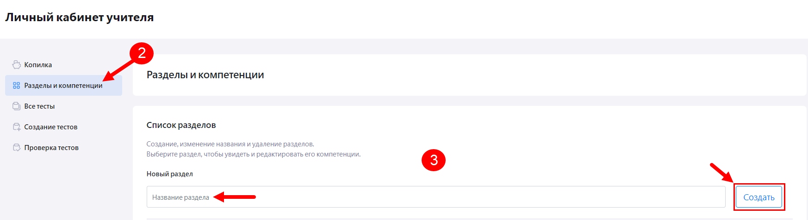
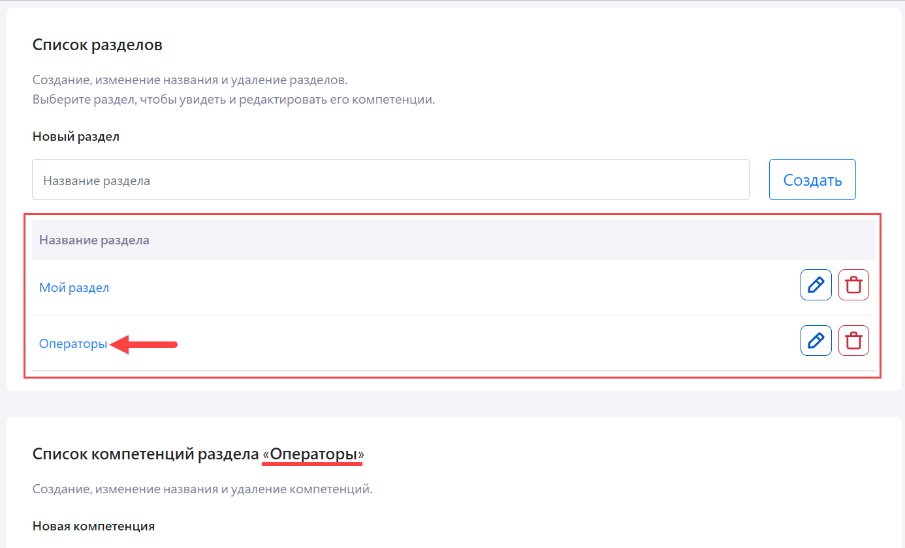
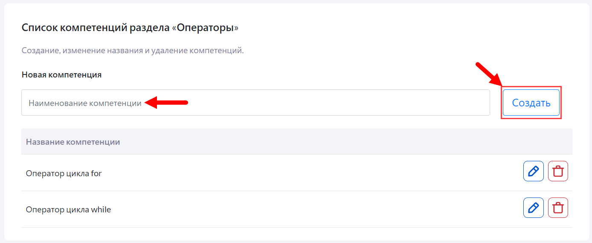

# Как расширить список компетенций?

Для расширения списка компетенций учителю необходимо:

1. Пройти в личный кабинет учителя в "Виртуальной библиотеке".
2. В меню слева выбрать раздел "Разделы и компетенции".
3. Ввести название нового раздела в поле "Новый раздел", нажать кнопку "Создать". Созданный раздел отобразится в списке под полем. Необходимо кликнуть на его название для выбора раздела.

Также можно не создавать новый раздел, если учитель создавал разделы ранее, и кликнуть на название одного из них из списка.
Название выбранного раздела будет отображено в названии блока "Список компетенций раздела "Название выбранного раздела"".

4. Ввести название новой компетенции в поле "Новая компетенция" и нажать кнопку "Создать". Созданная компетенция отобразится в списке под полем. Для одного раздела можно создать несколько компетенций.
